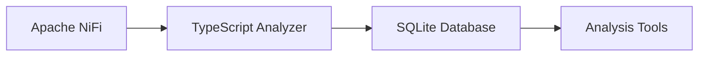

# NiFi Analyzer


Tired of not understanding why your Nifi sucks?

**New!** A TypeScript application that extracts processor information and performance metrics from Apache NiFi process groups and stores them in a SQLite database for analysis.

## Features

- 🔍 Recursively extracts processor information from all nested process groups
- 📊 Comprehensive performance metrics collection and analysis
- 💾 Stores data in SQLite database with structured schema
- **LLM compatible** - `llm.md` can help Language Models create SQL queries for you.

## What Can I do with it?

- 🔍 Detect bottlenecks
- 📊 create your own visualizations (not just "View Status History")

## Database Schema

The application stores information in multiple tables to enable detailed analysis:

### Core Tables
- `processors_info`: Basic processor configuration and settings
- `processors_properties`: Processor-specific property configurations
- `processors_status_history`: Historical performance metrics
- `connections_info`: Information about connections between processors
- `connections_targets`: Details about connection endpoints
- `nodes_info`: Information about NiFi cluster nodes

For detailed schema information, see [llm.md](llm.md).

## Quick Start

### Usage

 > If you are looking to run a local nifi instance, please refer to [Local NIfi Setup](#local-nifi-setup-optional)
1. **Install dependencies:**
   ```bash
   pnpm install
   ```

2. **Set environment variables:**
   ```bash
   export NIFI_URL="https://localhost:8080"
   export NIFI_USERNAME="admin"
   export NIFI_PASSWORD="12345678Matanel!"
   export PG_ID="root"  # Optional: specific process group ID
   ```

3. **Run the analyzer:**

   CLI Mode:

   ```bash
   pnpm start
   ```

   Web UI Mode:

   ```bash
   pnpm start:server
   ```

   This will start an HTTP server with a web UI and an automated analysis route. While the server provides detailed console logging, please note that it has limited exception handling. Keep an eye on system logs for any unexpected issues.

### Standalone Analyzer for External NiFi

To run just the analyzer against an external NiFi instance:

```bash
# Set environment variables for external NiFi
export NIFI_URL="https://your-external-nifi.com:8080"
export NIFI_USERNAME="your-username"
export NIFI_PASSWORD="your-password"
export DB_PATH="./output.db"  # Local SQLite file

# Run the analyzer
pnpm start
```

This will create a local `output.db` SQLite file that you can analyze directly with any SQLite client.

### Local NiFi Setup (Optional)

Start and stop your preferred NiFi version using the provided scripts:

**For Linux/macOS:**
```bash
# Start NiFi v1.28.0 (default)
./scripts/start-nifi.sh

# Start NiFi v2.2.0
./scripts/start-nifi.sh v2

# Stop all NiFi instances
./scripts/stop-nifi.sh

# Stop specific version
./scripts/stop-nifi.sh v1
./scripts/stop-nifi.sh v2
```

**For Windows:**
```cmd
# Start NiFi v1.28.0 (default)
scripts\start-nifi.bat

# Start NiFi v2.2.0
scripts\start-nifi.bat v2

# Stop all NiFi instances
scripts\stop-nifi.bat

# Stop specific version
scripts\stop-nifi.bat v1
scripts\stop-nifi.bat v2
```

## Configuration

### Environment Variables

- `NIFI_URL` - NiFi instance URL (default: `https://localhost:8080`)
- `NIFI_USERNAME` - NiFi username
- `NIFI_PASSWORD` - NiFi password
- `PG_ID` - Process Group ID to analyze (default: prompts for selection)
- `DB_PATH` - SQLite database path (default: `/data/output.db`)

### Process Group Selection

If `PG_ID` is not provided, the application will:

1. Fetch all root-level process groups
2. Present an interactive menu for selection
3. Allow choosing "Root" to analyze all process groups

## Architecture



## Analysis Examples

### Performance Analysis

Find processors with longest execution times:

```sql
SELECT MAX(psh.task_millis) / 1000 AS duration, 
       pi.name AS name, 
       pi.type AS type
FROM processors_status_history psh
JOIN processors_info pi ON psh.processor_id = pi.id
WHERE psh.task_millis > 0
GROUP BY psh.processor_id
ORDER BY MAX(psh.task_millis) DESC;
```

Identify potential bottlenecks by lineage duration:

```sql
SELECT psh.processor_id,
       MAX(psh.average_lineage_duration) as average_lineage,
       pi.type,
       pi.name
FROM processors_status_history psh
JOIN processors_info pi ON psh.processor_id = pi.id
WHERE psh.average_lineage_duration > 0
GROUP BY processor_id
ORDER BY average_lineage;
```

Find load-balanced connections:

```sql
SELECT 
    c.name AS connection_name,
    src.name AS source_name,
    dst.name AS destination_name,
    c.load_balance_strategy,
    c.load_balance_partition_attribute
FROM connections_info c
JOIN connections_targets src ON c.source_id = src.id
JOIN connections_targets dst ON c.destination_id = dst.id
WHERE c.is_load_balanced = TRUE;
```

### Configuration Analysis

Get processors with high run duration:

```sql
SELECT name, type, run_duration, concurrent_tasks
FROM processors_info
WHERE run_duration >= 1000
ORDER BY run_duration DESC;
```

Get processor type distribution:

```sql
SELECT type, COUNT(*) as count 
FROM processors_info 
GROUP BY type 
ORDER BY count DESC;
```

## Security Considerations

⚠️ **Important Security Notes:**

- Default credentials are used for development only
- Change default passwords in production environments
- Ensure NiFi instance is properly secured
- Use environment variables for sensitive configuration
- The analyzer uses `NODE_TLS_REJECT_UNAUTHORIZED=0` to bypass certificate validation

## Troubleshooting

### Common Issues

**NiFi Connection Issues:**

- Verify NiFi is running and accessible
- Check credentials
- Wait for NiFi to fully start (2-3 minutes)
- Self-signed certificate warnings are bypassed automatically

**SQLite Errors:**

- Ensure write permissions to data directory
- Verify sufficient disk space
- Check that native SQLite libraries are available

### Development

**Prerequisites:**

- Node.js 18+
- pnpm
- TypeScript
- SQLite

**Scripts:**

- `pnpm start` - Run the analyzer
- `pnpm build` - Compile TypeScript

### Security Notes

⚠️ **Important:**

- Default credentials are for development only
- Change default passwords in production
- Ensure NiFi instance is properly secured
- Use environment variables for sensitive configuration
- Certificate validation is bypassed for development

### License

ISC License


### Development Workflow

The analyzer uses a multi-stage Dockerfile with volume mounting:

1. **Dependencies are pre-installed** in the builder stage
2. **Edit TypeScript files** in your local `src/` directory
3. **Changes are immediately available** in the container
4. **Restart the analyzer** to pick up changes:
   ```bash
   docker compose restart nifi-analyzer
   ```

### Logs

The application provides detailed logging:
- ✅ Success operations
- ⚠️ Warnings and fallbacks
- ❌ Errors and failures
- 📊 Progress indicators

## Development

### Prerequisites

- Node.js 18+
- pnpm
- TypeScript
- Docker & Docker Compose

### Scripts

- `pnpm start` - Run the analyzer
- `pnpm build` - Compile TypeScript
- `pnpm test` - Run tests (when implemented)

### Contributing

1. Follow TypeScript best practices
2. Use functional programming patterns where possible
3. Maintain comprehensive error handling
4. Add appropriate logging
5. Follow DRY and KISS principles

## License

ISC License
